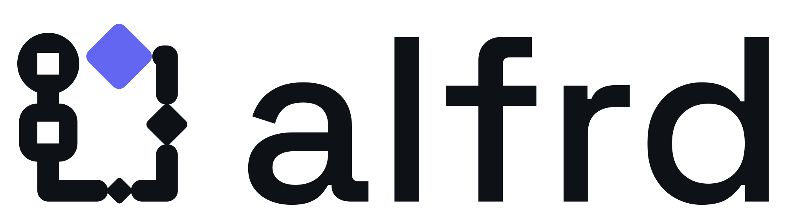

# ALFRD logo and brand

<picture>
  <source media="(prefers-color-scheme: dark)" srcset="alfrd-lockup-dark.svg">
  
</picture>

## The mark

A run loop. On the left, a start node (circle) and a step (rounded square) sit on one rail. The
rail goes down, along the bottom, up the right side and back along the top, so a run always
returns to the start: an agent loop, a retry, the next pass of a plan.

Several runs travel the loop at the same time. They sit in gaps in the rail and grow in
golden-ratio steps, **2.2 → 3.5 → 5.6** (×1.6 each). The largest, in accent colour, is the lead run and
doubles as the arrowhead that closes the loop. The centre stays empty so the path reads as a
loop at any size.

Construction, 24-unit grid (local visual box x 2.1–20.97, y 1.24–21.56; the files centre it):

```svg
<!-- rail: round caps and joins -->
<path d="M5.5 9.2V10.6M5.5 16.6V20H10.84M15.76 20H18.5V16.07M18.5 9.33V5.2H18.1"
      fill="none" stroke="#0E1116" stroke-width="2.4" stroke-linecap="round" stroke-linejoin="round"/>
<!-- start node and step, each with a square pin cut out -->
<path fill-rule="evenodd" fill="#0E1116" d="M5.5 2.6A3.4 3.4 0 1 1 5.5 9.4A3.4 3.4 0 1 1 5.5 2.6Z
  M4.3 4.8H6.7V7.2H4.3Z M4.3 10.4H6.7A2 2 0 0 1 8.7 12.4V14.8A2 2 0 0 1 6.7 16.8H4.3
  A2 2 0 0 1 2.3 14.8V12.4A2 2 0 0 1 4.3 10.4Z M4.3 12.4H6.7V14.8H4.3Z"/>
<!-- runs: squares rotated 45°, corner radius 0.16 × side -->
<rect x="12.2" y="18.9" width="2.2" height="2.2" rx="0.35" fill="#0E1116" transform="rotate(45 13.3 20)"/>
<rect x="16.75" y="10.95" width="3.5" height="3.5" rx="0.56" fill="#0E1116" transform="rotate(45 18.5 12.7)"/>
<rect x="10.46" y="2.4" width="5.6" height="5.6" rx="0.9" fill="#6366F1" transform="rotate(45 13.26 5.2)"/>
```

Each gap in the rail is the run's half-diagonal plus 0.9, so the runs never touch the line and
the mark has no overlaps: it works in one colour, cut from vinyl, engraved or embroidered.

The favicon / app icon (`alfrd-icon.svg`, `src/alfrd/web/assets/favicon.svg`) puts the mark on
an ink tile at 86 % size with a 2.8 rail so it holds at 16 px. Drawn by hand: one start node,
one L-shaped loop with three gaps, three diamonds, the last one biggest, in the accent colour.

## Files

| File | Use |
| --- | --- |
| `alfrd-lockup-light.svg` | Mark + wordmark on light backgrounds |
| `alfrd-lockup-dark.svg` | Mark + wordmark on dark backgrounds |
| `alfrd-mark.svg` | Mark only, follows the system light/dark setting |
| `alfrd-mark-light.svg` / `alfrd-mark-dark.svg` | Mark only, fixed colours |
| `alfrd-icon.svg` | App icon / favicon (ink tile) |

The Studio's favicon set (`favicon.svg`, `favicon.ico`, `favicon-32.png`,
`apple-touch-icon.png`, `icon-192.png`, `icon-512.png`, `site.webmanifest`) is in
`src/alfrd/web/assets/`. The Studio header and the access page use `favicon.svg`.

## Colours

| Token | Hex | Use |
| --- | --- | --- |
| Ink | `#0E1116` | Mark and text on light; icon tile |
| Paper | `#F6F5F2` | Light background |
| On-dark | `#F2F1EC` | Mark and text on dark |
| Accent | `#6366F1` | The lead run only. Matches the Studio accent (Obsidian Orbit) |

Inside the Studio the lead run follows the active theme: the header logo is drawn with
`var(--accent)` and the tab icon is redrawn from `--accent` whenever a theme stylesheet loads
(Daylight Orbit gives `#4F46E5`, a drop-in theme gives its own). The static files (PNG/ICO,
`docs/brand/`) use `#6366F1`. Keep the accent for the lead run only. In one-colour use, the lead run takes the ink colour.

## Wordmark

Lowercase `alfrd` in Space Grotesk Medium (500), tracking +0.01 em, converted to outlines in
the SVGs. Space Grotesk is under the SIL Open Font License 1.1. In running text, the name is
written ALFRD (Automated Logical FRamework for Dynamic script execution).

## Usage

- Clear space: at least the lead run's width on every side.
- Minimum size: 16 px for the icon, 90 px wide for the lockup.
- Don't rotate, mirror (the loop runs clockwise), stretch, outline or add effects.
